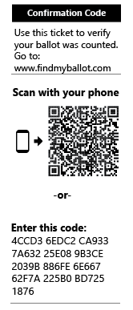
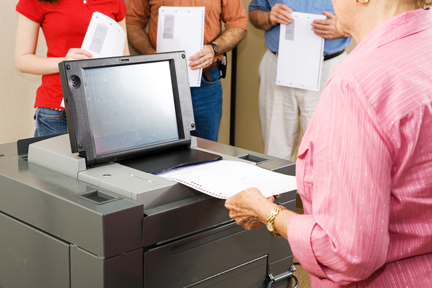
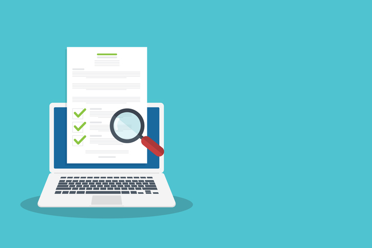
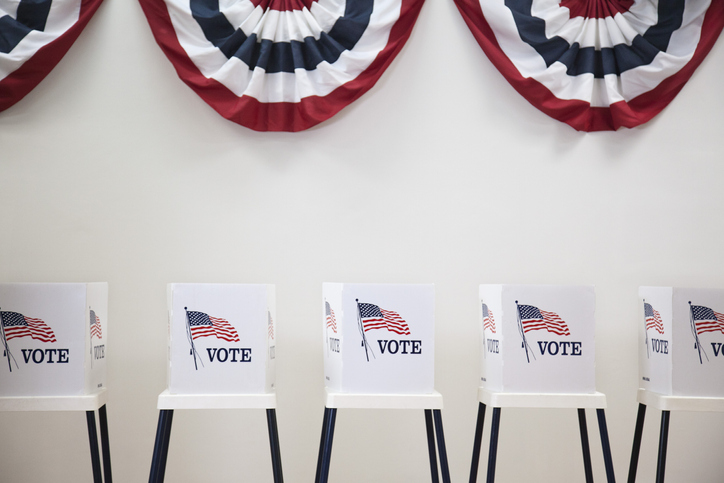
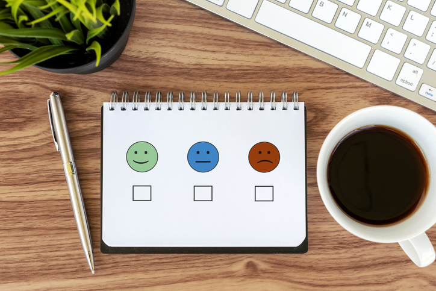

![Microsoft Democracy Forward Program: ElectionGuard][election-guard-banner]

# ElectionGuard in the November 2022 General Election

Some voters in the 2022 November General Election will experience ElectionGuard for the first time.  In those districts, voters will be able to use a confirmation code to see for themselves that their ballot was counted.  Others may choose to run a BallotCheck. 

In addition, other vendors contributed services and capabilities to showcase how independent verification of elections work. Hart InterCivic has integrated ElectionGuard into its Verity precinct scanners; MITRE wrote an independent verifier; and Enhanced Voting is provided the confirmation code lookup service.

??? info "Confirm that your ballot was counted"
    **[Scan or enter your confirmation code](https://www.egvote.us/cc/id/22)** and see for yourself that your ballot was included in the results.

    {align=center}
??? info "Complete a BallotCheck and check the accuracy of the voting system"
    **[Use the BallotCheck code](https://www.egvote.us/cc/id/22)** and check that system has encrypted it correctly.

    {align=center}
??? info "See the Independent Verifier report"
    **[Go to the Verifier site](https://electionintegrity.mitre.org/verifier/)** to see a report of the mathematical tests of the ElectionGuard specification

    {align=center}
??? info "Read the ElectionGuard questions and answers"
    Have a question about ElectionGuard or the pilot? **[We have answers.](faq.md)**

    {align=center}
??? info "Give us your feedback!"
    Did you participate in ElectionGuard on Election Day? We want to know what you think **[Go to our online form to give us your feedback.](www.egvote.us/feedback)**

    {align=center}

<!-- Links -->
[election-guard-banner]: images/electionguard-banner.svg "ElectionGuard banner"
